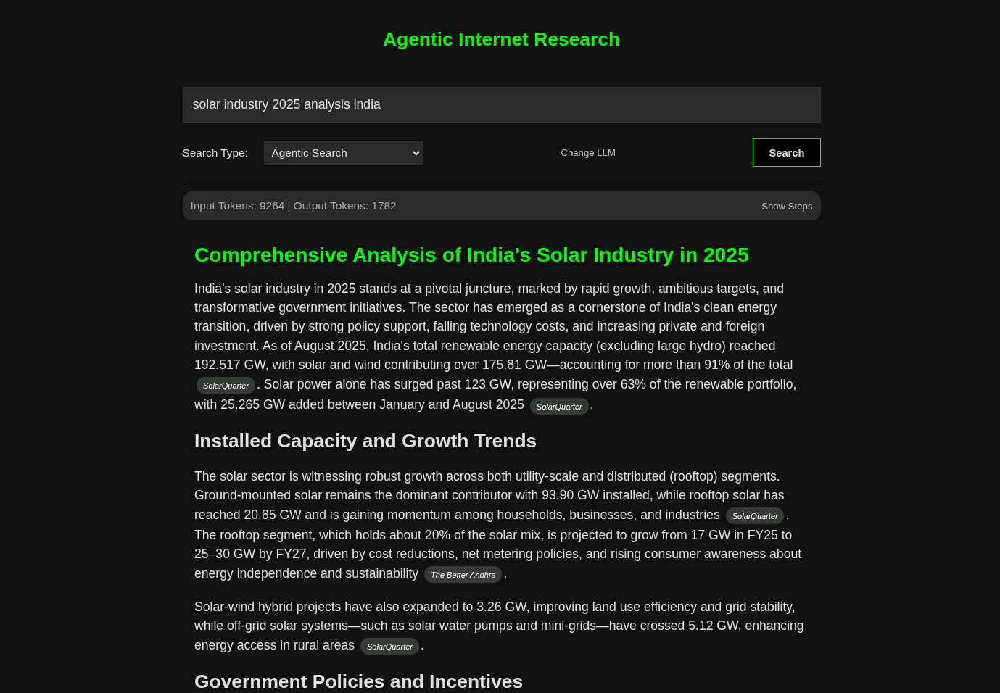

# Agentic Internet Researcher

- This project is a demonstration of how agentic behaviour can be applied for researching on internet using LLMs, vector embedding, RAG techniques and tool calling techniques.

- Monitoring the agent as it is working in the background is essential to build trust, and to give control to the user. Hence following data is being displayed on the user interface:
    - input and output tokens being used in a session.
    - queries made by agent, and a loading message explaining what is agent doing.
    - source of the knowledge LLM referred to in the response.

- All models don't have support for tool calling. Hence, I have used prompting techniques to enable tool-calling on any LLM. Reference: [arxiv](https://arxiv.org/html/2407.04997v1)

### Example:

<!--  -->


### How to download:

Make sure you have python installed on your system.

1. Copy paste this in terminal:

```bash
pip install -r requirements.txt
flask run
```

2. Then wait until you see "Running on http://127.0.0.1:5000" in the terminal. Once you see it, open that link.

It may take time to start the app because it loads heavy libraries used for vector embedding.\
But once started, it will run on optimal speed.


### Connecting your LLM:

You can connect to your language model from any provider.
1. Input API key provided to you by your provider
2. Input base url of the provider. For example, if your provider is openai, use: `https://api.openai.com/v1`. You can find your provider's base url on their documentation, or just search on internet.
3. Input model name exactly as mentioned by the provider.
4. Once you connect your LLM, your browser will save them in secure cookies so that you don't have to input it every time your open.
5. To change your LLM, click on `change LLM` button.

### Future Scope:

There are potential improvements and additional features that can be done in this project. Example:
1. A button to stop the LLM if they feel something is wrong or they don't want to continue.
2. More "Search Types"
3. More efficient citation technique\
etc.

They will be worked on if this project is loved enough.

### Note:

Agentic behaviour requires model to be intelligent. A low intelligent model may perform bad. 

### Licence

MIT Licence

### My X account:

https://x.com/parthhimself